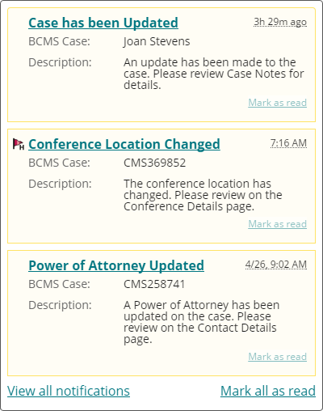

# Notifications

The notifications plugin displays a series of **messages** in a [popover](../popover/) and manages their read/unread status.

A message may be added by calling the following function:

```js
emp.notifications.push(msg1);
```

Multiple messages may be added by sending an array:

```js
emp.notifications.push([msg1, msg2, msg3, ...]);
```

## Messages

Each message is an object consisting of the follow properties:

Property | Type | Required | Description
--- | --- | --- | ---
`id` | String | Yes | An ID unique to this message
`title` | String | Yes | The main "headline" of the message
`url` | String | Yes | The URL that the `title` will link to, e.g. a tabset URL
`timestamp` | Number | Yes | The date and time stamp of the message in the [Unix epoch standard](http://www.unixtimestamp.com/) format.
`priority` | Number | No | A value of `1` indicates the message has high priority. For messages that are not high priority, this property may be omitted entirely or set to a falsy value such as `0` or `false`.
`fields` | Array | No | A list of [field objects](#fields) to be displayed with the message

#### Message example

This contains three messages:

```js
[
    {
        "id": "abc123",
        "title": "Case has been Updated",
        "url": "http://example.com",
        "timestamp": 1461765775,
        "fields": [
            {
                "label": "BCMS Case:",
                "data": "Joan Stevens"
            },
            {
                "label": "Description:",
                "data": "An update has been made to the case. Please review Case Notes for details."
            }
        ]
    },
    {
        "id": "def456",
        "title": "Conference Location Changed",
        "url": "http://example.com",
        "timestamp": 1461755775,
        "priority": 1,
        "fields": [
            {
                "label": "BCMS Case:",
                "data": "CMS369852"
            },
            {
                "label": "Description:",
                "data": "The conference location has changed. Please review on the Conference Details page."
            }
        ]
    },
    {
        "id": "ghi789",
        "title": "Power of Attorney Updated",
        "url": "http://example.com",
        "timestamp": 1461675775,
        "fields": [
            {
                "label": "BCMS Case:",
                "data": "CMS258741"
            },
            {
                "label": "Description:",
                "data": "A Power of Attorney has been updated on the case. Please review on the Contact Details page."
            }
        ]
    }
]
```

The above example may appear like on the page like this:



### Fields

Each field object contains `label` and `data` properties. Both properties should receive string values. They may include HTML.

#### Fields example

```js
"fields": [
    {
        "label": "BCMS Case:",
        "data": "CMS123456"
    },
    {
        "label": "Description:",
        "data": "An update has been made to the case. Please review Case Notes for details."
    }
]
```

## Framework notes

### On load

If a page has unread notifications at the time of rendering, the `fwData` object should contain a notifications property as shown:

```js
fwData = {
    "notifications": {
        "messages": []
    }
}
```

### Live updates

*To be determined*

### Updating a messages status

*To be determined*
